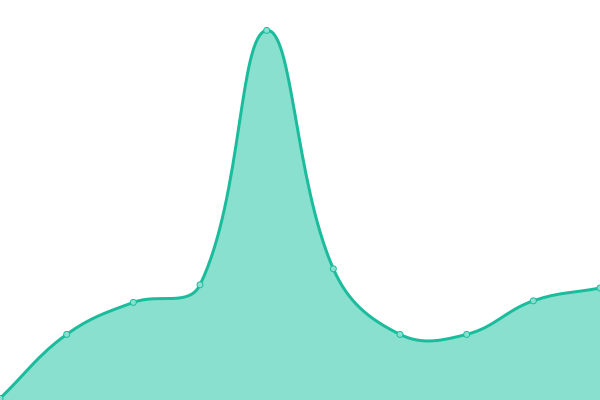

# [📈 Live Status](https://upptime.0ms.dev): <!--live status--> **🟥 Complete outage**

This repository contains the open-source uptime monitor and status page for [arasseo.](https://upptime.0ms.dev), powered by [Upptime](https://github.com/upptime/upptime).

With [Upptime](https://upptime.js.org), you can get your own unlimited and free uptime monitor and status page, powered entirely by a GitHub repository. We use [Issues](https://github.com/galpt/upptime/issues) as incident reports, [Actions](https://github.com/galpt/upptime/actions) as uptime monitors, and [Pages](https://upptime.0ms.dev) for the status page.

<!--start: status pages-->
<!-- This summary is generated by Upptime (https://github.com/upptime/upptime) -->
<!-- Do not edit this manually, your changes will be overwritten -->
<!-- prettier-ignore -->
| URL | Status | History | Response Time | Uptime |
| --- | ------ | ------- | ------------- | ------ |
|  [0ms.dev Home Page](https://0ms.dev) | 🟥 Down | [0ms-dev-home-page.yml](https://github.com/galpt/upptime/commits/HEAD/history/0ms-dev-home-page.yml) | 

 358ms
     
 | 

<a href="https://status.0ms.dev/history/0ms-dev-home-page">81.02%</a>
    

|  [0ms.dev Mirrors](https://0ms.dev/mirrors/) | 🟥 Down | [0ms-dev-mirrors.yml](https://github.com/galpt/upptime/commits/HEAD/history/0ms-dev-mirrors.yml) | 

 136ms
     
 | 

<a href="https://status.0ms.dev/history/0ms-dev-mirrors">80.92%</a>
    

|  [0ms.dev DNS variant Unfiltered](https://0ms.dev/dns-query) | 🟥 Down | [0ms-dev-dns-variant-unfiltered.yml](https://github.com/galpt/upptime/commits/HEAD/history/0ms-dev-dns-variant-unfiltered.yml) | 

 58ms
     
 | 

<a href="https://status.0ms.dev/history/0ms-dev-dns-variant-unfiltered">80.92%</a>
    

|  [0ms.dev DNS variant Security](https://0ms.dev/dns-security) | 🟥 Down | [0ms-dev-dns-variant-security.yml](https://github.com/galpt/upptime/commits/HEAD/history/0ms-dev-dns-variant-security.yml) | 

 73ms
     
 | 

<a href="https://status.0ms.dev/history/0ms-dev-dns-variant-security">80.92%</a>
    

|  [0ms.dev DNS variant Adblock](https://0ms.dev/dns-adblock) | 🟥 Down | [0ms-dev-dns-variant-adblock.yml](https://github.com/galpt/upptime/commits/HEAD/history/0ms-dev-dns-variant-adblock.yml) | 

 55ms
     
 | 

<a href="https://status.0ms.dev/history/0ms-dev-dns-variant-adblock">80.92%</a>
    

|  [0ms.dev DNS variant CN Optimized](https://0ms.dev/dns-cn) | 🟥 Down | [0ms-dev-dns-variant-cn-optimized.yml](https://github.com/galpt/upptime/commits/HEAD/history/0ms-dev-dns-variant-cn-optimized.yml) | 

 60ms
     
 | 

<a href="https://status.0ms.dev/history/0ms-dev-dns-variant-cn-optimized">80.92%</a>
    

|  [0ms.dev DNS variant DNS64 Unfiltered](https://0ms.dev/dns64) | 🟥 Down | [0ms-dev-dns-variant-dns-64-unfiltered.yml](https://github.com/galpt/upptime/commits/HEAD/history/0ms-dev-dns-variant-dns-64-unfiltered.yml) | 

 53ms
     
 | 

<a href="https://status.0ms.dev/history/0ms-dev-dns-variant-dns-64-unfiltered">80.92%</a>
    

|  [0ms.dev DNS variant Accelerator](https://0ms.dev/dns/dns.google/dns-query) | 🟥 Down | [0ms-dev-dns-variant-accelerator.yml](https://github.com/galpt/upptime/commits/HEAD/history/0ms-dev-dns-variant-accelerator.yml) | 

 118ms
     
 | 

<a href="https://status.0ms.dev/history/0ms-dev-dns-variant-accelerator">80.92%</a>
    

|  [0ms.dev DNS variant Multiqueue](https://0ms.dev/mq/dns.google/dns-query/mq/freedns.controld.com/p0) | 🟥 Down | [0ms-dev-dns-variant-multiqueue.yml](https://github.com/galpt/upptime/commits/HEAD/history/0ms-dev-dns-variant-multiqueue.yml) | 

 66ms
     
 | 

<a href="https://status.0ms.dev/history/0ms-dev-dns-variant-multiqueue">80.92%</a>
    

<!--end: status pages-->

[**Visit our status website →**](https://upptime.0ms.dev)

## 📄 License

- Powered by: [Upptime](https://github.com/upptime/upptime)
- Code: [MIT](./LICENSE) © [Anand Chowdhary](https://anandchowdhary.com), supported by [Pabio](https://pabio.com)
- Data in the `./history` directory: [Open Database License](https://opendatacommons.org/licenses/odbl/1-0/)
