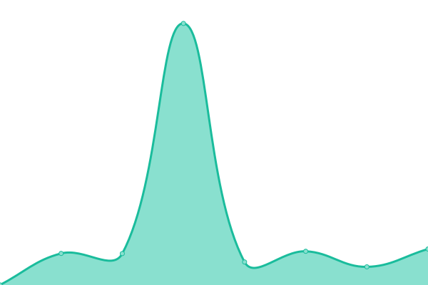

# [📈 Live Status](https://upptime.0ms.dev): <!--live status--> **🟩 All systems operational**

This repository contains the open-source uptime monitor and status page for [arasseo.](https://upptime.0ms.dev), powered by [Upptime](https://github.com/upptime/upptime).

With [Upptime](https://upptime.js.org), you can get your own unlimited and free uptime monitor and status page, powered entirely by a GitHub repository. We use [Issues](https://github.com/galpt/upptime/issues) as incident reports, [Actions](https://github.com/galpt/upptime/actions) as uptime monitors, and [Pages](https://upptime.0ms.dev) for the status page.

<!--start: status pages-->
<!-- This summary is generated by Upptime (https://github.com/upptime/upptime) -->
<!-- Do not edit this manually, your changes will be overwritten -->
<!-- prettier-ignore -->
| URL | Status | History | Response Time | Uptime |
| --- | ------ | ------- | ------------- | ------ |
|  [Landing Page](https://v.recipes) | 🟩 Up | [landing-page.yml](https://github.com/galpt/upptime/commits/HEAD/history/landing-page.yml) | 

 325ms
     
 | 

<a href="https://status.v.recipes/history/landing-page">100.00%</a>
    

|  [DNS](https://v.recipes/dns/) | 🟩 Up | [dns.yml](https://github.com/galpt/upptime/commits/HEAD/history/dns.yml) | 

 343ms
     
 | 

<a href="https://status.v.recipes/history/dns">100.00%</a>
    

|  [Bufferbloat Test](https://v.recipes/bufferbloat/) | 🟩 Up | [bufferbloat-test.yml](https://github.com/galpt/upptime/commits/HEAD/history/bufferbloat-test.yml) | 

 195ms
     
 | 

<a href="https://status.v.recipes/history/bufferbloat-test">100.00%</a>
    

<!--end: status pages-->

[**Visit our status website →**](https://upptime.0ms.dev)

## 📄 License

- Powered by: [Upptime](https://github.com/upptime/upptime)
- Code: [MIT](./LICENSE) © [Anand Chowdhary](https://anandchowdhary.com), supported by [Pabio](https://pabio.com)
- Data in the `./history` directory: [Open Database License](https://opendatacommons.org/licenses/odbl/1-0/)
